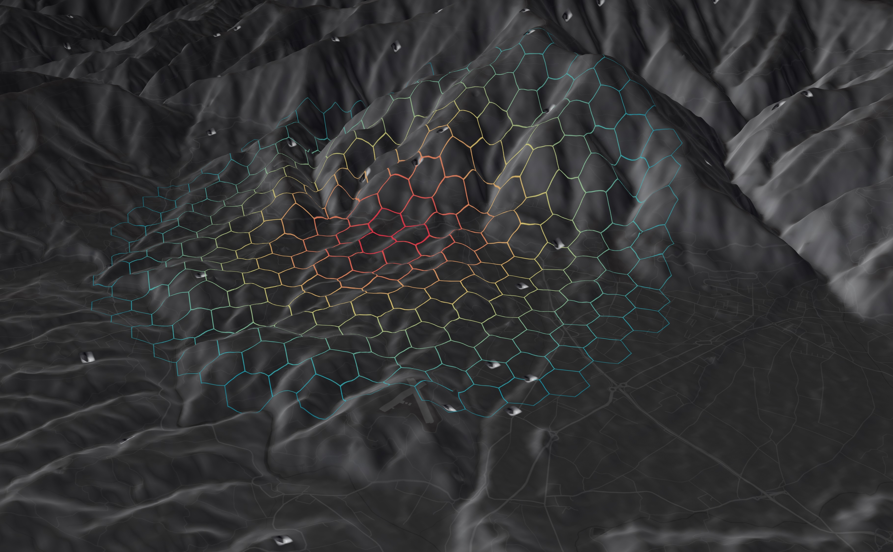

<h1>
  
  Wildfire OS — Wildfire Intelligence Operating System
</h1>

Wildfire OS is a **shared brain for Mediterranean fires** — a Portugal‑first, Mediterranean‑focused, human‑aware wildfire risk intelligence platform that delivers *calibrated and explainable ignition–spread–impact scenarios*. :contentReference[oaicite:0]{index=0}

## 🚀 About

Wildfire OS tackles the growing urgency of wildfire risk by combining rich data, advanced models, and practical tools to help researchers, organizations, and communities better understand and prepare for wildfire events. :contentReference[oaicite:1]{index=1}

- 📍 **Mediterranean focus:** Specifically tuned to factors driving wildfire risk across Portugal and Mediterranean regions. :contentReference[oaicite:2]{index=2}  
- 🔍 **Explainable insights:** Goes beyond raw hazard indicators to provide actionable, decision‑grade risk intelligence. :contentReference[oaicite:3]{index=3}  
- 🌐 **Multi‑use ecosystem:** Supports scientific research, operational planning, and community awareness. :contentReference[oaicite:4]{index=4}  

## 📊 Key Features

### 🧠 Data & Infrastructure
A harmonized, continuously updated data stack combining:
- Historical wildfires
- Satellite‑derived fuel & terrain metrics
- Weather and human‑exposure layers

All integrated for high‑resolution (10–30 m) analysis. :contentReference[oaicite:5]{index=5}

### 🔥 Risk Models
Prototype **ignition, spread, and impact models** calibrated on Portuguese wildfires, enabling realistic scenario generation and risk forecasting. :contentReference[oaicite:6]{index=6}

### 🛠 Tools & APIs
- REST APIs
- Python SDKs
- Interactive fuel & terrain explorers

Used to power research projects, operational systems, and custom dashboards. :contentReference[oaicite:7]{index=7}

### 🌍 Impact & Use Cases
- **Scientific & Technical:** Open, versioned data stacks forming a foundation for R&D and EU‑scale fire‑risk projects. :contentReference[oaicite:8]{index=8}  
- **Economic & Business:** Risk metrics that support insurers, banks, and utilities. :contentReference[oaicite:9]{index=9}  
- **Community Awareness:** Citizen‑facing apps and guidance for safer fuel practices and preparedness. :contentReference[oaicite:10]{index=10}

## 💡 Get Involved

Wildfire OS is open to collaborations that advance regional wildfire risk understanding and applications. Whether you’re a researcher, developer, policymaker, or community advocate, we’d love to hear from you.

👉 **Get Access & Support:** Visit the website for documentation and access links. :contentReference[oaicite:11]{index=11}

## 🌐 Website

🔗 https://wildfireos.org/

*Powered by open science and collaborative wildfire risk intelligence.*
::contentReference[oaicite:13]{index=13}

## 📄 License

This project is developed by **CiberMotriz Lda, Lisbon, Portugal**. © 2025 WildfireOS.org. :contentReference[oaicite:12]{index=12}